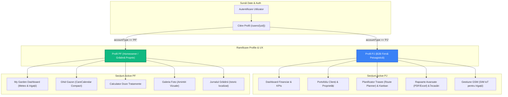
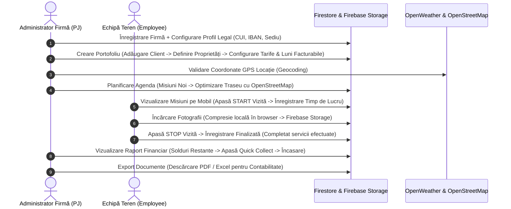
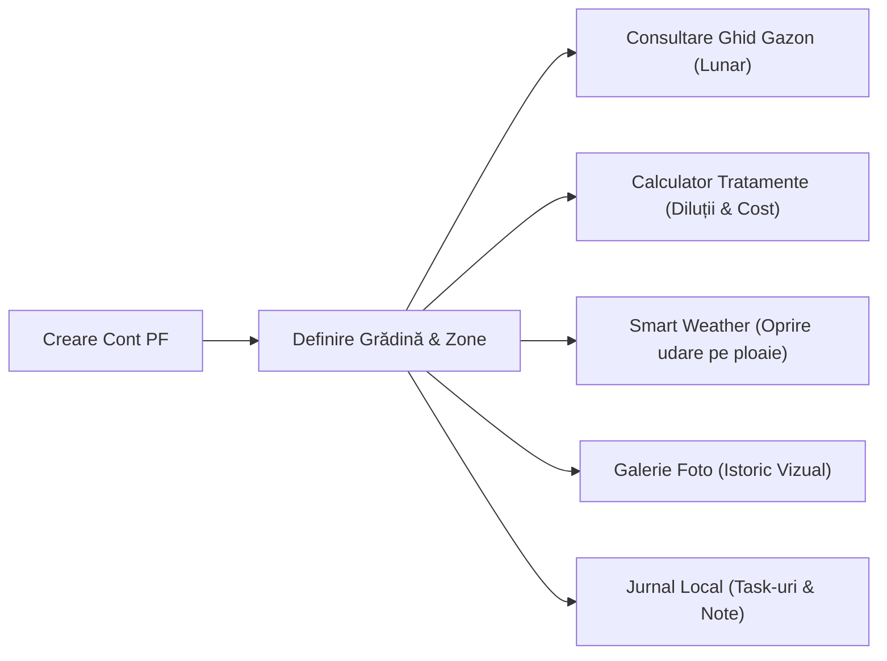

# 📘 LandscapeOS — Analiză Funcțională & Blueprint Tehnic Complet
> **Destinat:** Arhitectului de Sistem / Consiliului de Design & Dezvoltare
> **Proiect:** LandscapeOS (Sistem Integrat de Gestiune, Optimizare și Mentenanță Peisagistică)
> **Autor:** Antigravity AI
> **Data:** 17 Mai 2026
> **Status Sistem:** Finalizat în Producție (Sincronizat pe Git branch `main`)

---

## 1. Introducere & Arhitectură Multi-Tenant

**LandscapeOS** este o platformă modernă SaaS (Software as a Service) concepută special pentru digitalizarea și optimizarea activităților din domeniul peisagisticii și al întreținerii grădinilor. Sistemul folosește o arhitectură **serverless securizată** bazată pe **React (cu TypeScript și Vite)** pe frontend, în timp ce backend-ul este susținut în întregime de suita **Firebase (Firestore, Cloud Functions Gen 1 în Node 20, Storage și Hosting)**.

Aplicația implementează un model strict **Multi-Tenant** izolat din punct de vedere al securității prin `organizationId` la nivel de bază de date (Firestore Row-Level Security) și la nivel de stocare media (Storage Rules). Utilizatorii sunt clasificați în două mari profiluri, fiecare având un parcurs de utilizare (*User Journey*) complet distinct:



---

## 2. Parcursul Complet al Datelor (PJ vs. PF)

### 🚀 Fluxul A: Firma Peisagistică Profesională (PJ / B2B)
*De la crearea contului până la încasarea banilor și generarea rapoartelor financiare.*



#### Pasul 1: Crearea Contului & Onboarding Wizard
1. **Înregistrare**: Administratorul își creează contul prin email/parolă.
2. **Setup Companie**: Sistemul solicită datele juridice necesare facturării: **CUI / Cod Fiscal**, **Nr. Registrul Comerțului (Reg. Com.)**, **Cont IBAN**, **Banca**, **Adresă Sediu**, **Localitate** și **Județ**.
3. **Servicii Implicite**: Onboarding-ul configurează automat servicii de bază cu tarife orientative (ex. Tundere Gazon, Fertilizare Sezonieră, Tăiere Gard Viu, Aerare, Tratament Fitosanitar).
4. **Adăugare Echipă**: Administratorul poate trimite invitații pe email viitorilor angajați, aceștia primind rolul de `employee` după acceptarea codului unic generat.

#### Pasul 2: Adăugarea Clienților și a Proprietăților
1. **Adăugare Client B2B**: Se introduc numele de contact, telefonul (esențial pentru notificări WhatsApp) și datele juridice ale clientului dacă acesta este la rândul lui companie (PJ).
2. **Definire Proprietăți (Locații)**: Un client poate deține una sau mai multe proprietăți (ex. *Casă Vacanță Cornetu*, *Sediu Social*, *Showroom*). Fiecare locație are:
   * **Adresă fizică** și **Link Google Maps**.
   * **Suprafață (mp)** și definirea de **Zone personalizate** (ex. *Zonă Gazon*, *Zonă Flori*, *Livadă*).
   * **Sistem de Irigație**: Tipul programului (Zile stabilite, Interval de zile, Zile Pare/Impare), Ora de start și detalii tehnice controller.
3. **Parametri de Facturare și Contract (Nivel Locație)**:
   * **Tip Contract**: *Mentenanță*, *Lucrări Unice* sau *Proiect*.
   * **Frecvență Mentenanță**: *Săptămânal*, *La 2 săptămâni*, *Lunar* sau *Ocazional*.
   * **Tarife**: Tarif lunar fix (pentu abonamente) și tarif pe intervenție suplimentară.
   * **Luni Facturabile**: Se bifează exact lunile în care se facturează serviciile (ex. Aprilie – Noiembrie, iarna fiind oprită facturarea).
   * **Date Scadente**: Ziua din lună pentru emiterea facturii și numărul de zile pentru scadență.

#### Pasul 3: Planificarea, Agenda și Optimizarea Traseului
1. **Planificare**: Administratorul programează vizitele în **Calendar** sau direct în panoul **Kanban** prin Drag-and-Drop.
2. **Optimizare Traseu**: Sistemul preia coordonatele GPS ale proprietăților programate în ziua respectivă și apelează **OpenStreetMap (OSRM API)** pentru a arăta traseul pe hartă și a ordona vizitele în așa fel încât timpii și distanțele de condus să fie minime.

#### Pasul 4: Execuția în Teren (Angajați / Operatori)
1. **Vizualizare pe Mobil**: Angajatul vede agenda zilei ordonată, fără informații financiare ascunse prin rolul `employee`.
2. **Timp de Execuție (START / STOP)**:
   * Când ajunge la locație, angajatul apasă pe butonul **Pornește Vizita**. Sistemul pornește un cronometru persistent (salvat în cloud pentru a rezista la închiderea browserului sau restartarea telefonului).
   * Se pot face fotografii de la fața locului (pentru starea „Înainte”).
3. **Înregistrarea Activității (STOP)**:
   * Angajatul selectează serviciile efectuate și cantitățile utilizate (ex. *Tundere gazon: 350mp*, *Îngrășământ solid: 10kg*).
   * Se pot încărca fotografii finale (starea „După”). **Compresie Automată**: Browserul compresează pozele la rezoluție web optimă înainte de upload pentru viteză.
   * Angajatul apasă pe butonul **Finalizează Vizita** și introduce opțional o notă de lucru.

#### Pasul 5: Facturarea, Încasarea (Quick Collect) și Rapoartele
1. **Actualizare Solduri**: La finalizarea vizitei, dacă contractul este de tip *Lucrări Unice* sau dacă este începutul unei noi luni contractuale de *Mentenanță*, sistemul debitează automat soldul proprietății respective.
2. **Quick Collect**: În portofoliul de clienți sau în dashboard, administratorul vede restanțele. Apăsarea pe butonul **Încasează** deschide o casetă rapidă unde poate înregistra o plată totală sau parțială (Cash, Card, Transfer Bancar), actualizând instant soldul.
3. **Rapoarte Financiare**: Administratorul poate exporta jurnalele complete de încasări și restanțe sub formă de rapoarte premium **PDF** (curate, tabelare, pregătite pentru print) sau **Excel** (cu toate datele brute pentru contabilitate).

---

### 🏡 Fluxul B: Beneficiarul Individual (PF / Homeowner)
*O experiență simplificată, axată pe auto-îngrijirea propriei grădini.*



#### Pasul 1: Înregistrare Cont și Definire Grădină
1. Utilizatorul selectează profilul **PF** (Personal) la înregistrare.
2. **UI Simplificat**: Meniul de jos (Mobile Dock) este automat redus, iar elementele de tip B2B (Clienți, Oferte, Facturi, Echipamente, Angajați) sunt complet ascunse.
3. **Definire Grădină**: Își configurează propria grădină ca o singură proprietate principală (adresa, suprafață în mp și zonele de gazon/arbuști).

#### Pasul 2: Urmărirea Calendarului de Îngrijire (Ghid Gazon)
1. Utilizatorul intră în **Ghid Gazon (CareCalendar)**, o pagină cu un design deosebit de compact.
2. Selectează luna curentă dintr-un selector rapid cu butoane patrate (`w-20 h-20`).
3. Primește instant:
   * **Faza Biologică a lunii** (ex. repaus vegetativ, creștere intensă).
   * **Task-urile obligatorii** (ex. scarificare, tratament antifungic, fertilizare cu eliberare lentă).
   * **Sfatul Expertului**: O recomandare personalizată de la ingineri peisagiști.

#### Pasul 3: Calcularea Tratamente Fitosanitare & Îngrășăminte
1. Utilizatorul deschide **Calculatorul de Doze**:
2. Selectează tratamentul dorit din baza de date premium integrată:
   * *Champ 77 WG* (Fungicid pe bază de cupru, preț 24 lei / 200g, doză: 20-30g / 10L apă / 100mp).
   * *Kupferol* (Fungicid lichid premium, preț 31 lei / 500ml sau 54 lei / 1L).
   * *Alcupral 50 PU* (Fungicid clasic de contact, preț 69 lei / kg).
3. Introduce **suprafața gazonului** sau volumul de apă dorit.
4. **Calcul Automat**: Sistemul returnează instant cantitatea exactă de fungicid (în grame sau mililitri), cantitatea optimă de apă pentru dizolvare și costul financiar estimat al tratamentului aplicat.

#### Pasul 4: Protecție Inteligentă la Ploaie (Weather Rules)
1. Grădinarul vede starea meteo pe dashboard-ul său personalizat.
2. **Senzorul Meteo Cloud**: Dacă Cloud Function-ul central detectează ploaie torențială prognozată în zona sa, acesta va vedea statusul irigației marcat ca `delayed_by_rain` (Amânat din cauza ploii).
3. Utilizatorul poate apăsa pe butoanele din panou pentru a **suspenda manual udarea pe 24h** (dacă observă că solul este deja saturat) sau pentru a forța udarea în ciuda prognozei.

#### Pasul 5: Jurnalul și Galeria Foto (Amintiri Vizuale)
1. Utilizatorul poate înregistra activități manuale în **Jurnalul Grădinii** (ex. „Am tuns gazonul azi la 3cm”, „Am aplicat îngrășământ solid”).
2. Poate adăuga fotografii cu progresul grădinii. Aceste fotografii sunt afișate în **Galeria Foto (Garden Gallery)**, un feed superb stilizat cu un sistem de derulare infinită (Facebook-style scrolling), încărcând pozele din istoric în calupuri de câte 20 pe măsură ce utilizatorul explorează.

---

## 3. Ghid de Referință pentru Interfață (Meniuri & Butoane)

### 📊 Ecranul 1: Dashboard-ul Principal (Pentru Firme - PJ)
Ecranul de comandă central al administratorului firmei peisagistice.

| Element / Buton | Acțiune la Apăsare | Logică & Efect în Sistem |
| :--- | :--- | :--- |
| **Butonul „START LUCRU / STOP”** | Pornește/Oprește o sesiune de lucru generală. | Salvează starea în Firestore, monitorizează activitatea angajatului curent în jurnalul operațional. |
| **Weekly Progress (Bara de Progres)** | Vizualizare statică cu hover. | Calculează raportul procentual dintre vizitele finalizate și cele programate în săptămâna curentă. |
| **Timeline (Graficul Săptămânal)** | Hover pe barele de zi. | Afișează numărul de activități zilnice programate vs finalizate (Luni-Duminică). |
| **Heatmap Activitate** | Hover pe micropatratele zilnice. | Afișează densitatea vizitelor finalizate în ultimele 12 săptămâni, ordonată descrescător (săptămâna curentă în stânga) cu popup interactiv pentru numărul exact de lucrări. |
| **Caseta Meteo Sediul Firmei** | Detectare automată dinamică. | Interoghează OpenWeather pe baza coordonatelor/adresei companiei. Afișează temperatura, umiditatea și prognoza scurtă pentru planificarea echipelor. |
| **Top 5 Clienți (Widget)** | Apăsare pe numele unui client. | Redirecționează instant la dosarul clientului. Afișează raportul grafic dintre **Soldul Rămas (Restanțe)** și **Suma Totală Contractată** a celor mai importanți clienți. |

---

### 👥 Ecranul 2: Portofoliu Clienți & Formular Editare (PJ)
Zona unde se editează clienții și proprietățile acestora. Am reproiectat complet aspectul grilei de editare pentru a respecta cerințele precise de ergonomie:

```
+-----------------------------------------------------------------------------------+
| RAND 1 (Split 1/2 la 1/2)                                                         |
| +-----------------------------------------------+ +-------------------------------+ |
| | [DETALII LOCAȚIE] (1/2 Lățime)                | | [ZONE & SUPRAFAȚĂ] (1/2 Lăț.) | |
| | - Nume locație, Adresă, Link Maps, Coordonate | | - Suprafață Mp totală         | |
| | - Latitudine & Longitudine (GPS)               | | - Zone personalizate & mărimi| |
| +-----------------------------------------------+ +-------------------------------+ |
+-----------------------------------------------------------------------------------+
| RAND 2 (Split 2/3 la 1/3)                                                         |
| +-----------------------------------------------+ +-------------------------------+ |
| | [CONTRACT & FINANCIAR] (2/3 Lățime)           | | [SISTEM IRIGAȚII] (1/3 Lăț.)  | |
| | - Tip contract, Tarife abonament/intervenții  | | - Tip irigare (Zile/Interval) | |
| | - Zi emitere factură, Zi scadență             | | - Ora pornire, Detalii program| |
| |                                               | |                               | |
| | [LUNI FACTURABILE] (Rămâne dedesubt, în 2/3)   | | [CALCULATOR FERTILIZANT]      | |
| | - Selecție luni active (Bife Ianuarie-Dec)    | | (Rămâne dedesubt, în 1/3)     | |
| |                                               | | - Dozaj calculat automat mp   | |
| +-----------------------------------------------+ +-------------------------------+ |
+-----------------------------------------------------------------------------------+
```

#### Butoane și Acțiuni din Fișa Clientului:
* **Butonul „Salvează Modificări”**:
  * *La Apăsare*: Rulează validări de date (ex. corectitudinea numărului de telefon, formatul IBAN-ului).
  * *Efect*: Actualizează documentul `/clients/{clientId}` și `/properties/{propertyId}` în Firestore. Lansează notificare toast de succes.
* **Butonul „Adaugă Locație”**:
  * *La Apăsare*: Deschide un panou pentru introducerea unei adrese suplimentare pentru același client, generând o nouă înregistrare în colecția `properties`.
* **Butonul „Adaugă Zonă”**:
  * *La Apăsare*: Adaugă un rând dinamic în tabelul de sub-zone al proprietății (permite alocarea de metri pătrați specifici pentru gazon, flori, etc., esențial pentru calculul dozelor).
* **Butonul „Copiază Link Portal Client”**:
  * *La Apăsare*: Generează un token securizat și copiază în clipboard adresa URL a portalului web dedicat clientului respectiv (unde acesta își poate vedea istoricul și pozele, fără a se autentifica).

---

### 📅 Ecranul 3: Agenda & Optimizare Traseu (PJ)
Instrumentul de dispecerat și organizare logistică.

* **Filtru Calendar (Săptămână / Lună)**: Schimbă modul de vizualizare a vizitelor programate.
* **Panoul Drag-and-Drop Kanban**:
  * *La tragerea unei vizite dintr-o zi în alta*: Modifică instant câmpul `scheduledDate` al vizitei în Firestore. Declanșează automat recalcularea stocului de lucrări pentru ziua respectivă.
* **Butonul „Optimizează Traseul” (Harta Interactivă)**:
  * *La Apăsare*: Trimite coordonatele GPS ale tuturor clienților din ziua respectivă către OSRM API.
  * *Efect*: Reordonează indexul vizitelor din acea zi pentru a minimiza kilometrii parcurși. Actualizează vizual traseul marcat cu linii colorate pe hartă.
* **Butonul „Quick Reschedule” (Reprogramare Rapidă)**:
  * *La Apăsare*: Permite mutarea tuturor vizitelor dintr-o zi ploioasă în ziua următoare printr-un singur click.

---

### 📈 Ecranul 4: Modulul Financiar & Rapoarte (PJ)
Panoul de control al lichidităților și al fluxului de numerar (*Cash Flow*).

* **Butonul „Quick Collect” (Încasare Rapidă)**:
  * *La Apăsare*: Deschide un modal compact pre-completat cu soldul datorat de clientul selectat.
  * *Efect*: Înregistrează suma primită, emite o chitanță virtuală în istoric și scade soldul datorat instant.
* **Butonul „Descarcă PDF”**:
  * *La Apăsare*: Generează în timp real un document PDF premium structurat cu logo-ul firmei, cuprinzând lista facturilor emise, încasările efectuate și tabelul cu rău platnici.
* **Butonul „Descarcă Excel”**:
  * *La Apăsare*: Generează un fișier `.xlsx` cu toate tranzacțiile din baza de date pentru intervalul de timp selectat, gata de trimis către contabil.

---

## 4. Recomandări de Îmbunătățire & Extindere (Pentru Arhitect)

În urma analizei riguroase a codului sursă și a structurii curente, am identificat **4 direcții strategice** de optimizare pe care arhitectul de sistem le poate evalua și valida pentru versiunile viitoare:

### 1. Webhook-uri pentru Facturare Automată (Smart Invoicing)
* **Situația curentă**: Sistemul calculează soldurile restanțe în mod corect în Firestore pe baza vizitelor finalizate, dar emiterea facturilor fiscale fizice se face manual sau extern.
* **Propunere Arhitecturală**: Integrarea unui serviciu de facturare online din România (ex. **SmartBill API** sau **FGO API**).
* **Flux propus**: La încheierea unei luni contractuale de mentenanță (pe baza parametrului `ziEmitereFactura` din proprietate), un Cloud Function planificat (cronjob la ora 23:59) rulează o interogare în Firestore, calculează automat sumele și trimite un request API către SmartBill pentru generarea automată a facturii fiscale și transmiterea acesteia prin email/e-Factura direct la client.

### 2. Integrare Plăți Online Direct în Portalul Clientului
* **Situația curentă**: Clienții primesc un link către Portalul lor Securizat unde își văd soldul, dar plățile sunt înregistrate doar manual de administrator prin *Quick Collect*.
* **Propunere Arhitecturală**: Integrarea unui procesator de plăți cu acoperire națională (ex. **Netopia Payments** sau **Stripe**).
* **Flux propus**: Adăugarea unui buton **„Plătește Online cu Cardul”** direct în Portalul Clientului. La apăsare, clientul este redirecționat către o pagină de checkout securizată, iar la finalizarea plății, un webhook Netopia apelează o funcție HTTPS din Firebase (`/onPaymentReceived`), care mută automat tranzacția în starea `Încasată` și scade soldul în timp real, fără intervenția manuală a administratorului.

### 3. Integrare IoT Releuri Inteligente (Smart Irrigation Controllers)
* **Situația curentă**: Prognoza meteo amână udarea în Firestore la nivel teoretic (`delayed_by_rain`), dar nu există o conexiune hardware fizică.
* **Propunere Arhitecturală**: Expunerea unui API securizat la nivel de Cloud Functions (`/irrigation-status/{propertyId}`) care să fie interogat periodic de microcontrollere Wi-Fi ieftine (ex. **ESP32** conectate la electrovalve de 24V).
* **Flux propus**: ESP32 trimite un request GET cu o cheie API unică o dată la 30 de minute. Cloud Function-ul citește starea proprietății din Firestore (dacă prognoza OpenWeather a oprit irigarea sau dacă utilizatorul a setat o suspendare manuală) și returnează un JSON simplu: `{ "shouldWater": false, "durationMinutes": 0 }`. Astfel, programarea fizică a irigațiilor din curte se modifică în timp real în funcție de deciziile inteligente din LandscapeOS!

### 4. Sistem Automat de Notificări WhatsApp (Customer Loyalty)
* **Situația curentă**: Administratorul poate genera textul pentru mesajul WhatsApp către datornici, dar trebuie să trimită manual prin aplicație.
* **Propunere Arhitecturală**: Integrarea API-ului oficial **Twilio WhatsApp Business** sau a unui serviciu local.
* **Flux propus**: Când o vizită este finalizată de o echipă în teren, un trigger din Firestore pe colecția `client_history` trimite automat un mesaj pe WhatsApp clientului: *„Bună! Echipa LandscapeOS tocmai a finalizat întreținerea grădinii tale. Timp de lucru: 45 min. Poți vedea pozele și fișa de intervenție aici: [Link Portal]”*. Acest lucru oferă un nivel uriaș de transparență și încredere clienților!

---

> [!NOTE]
> Acest document cuprinde întregul blueprint funcțional și operațional al aplicației LandscapeOS. Este structurat pentru a fi citit cu ușurință de arhitectul dumneavoastră și reprezintă fundamentul perfect pentru planificarea viitoarelor integrări hardware și financiare! Toate componentele menționate mai sus sunt integrate, funcționale și sincronizate pe repository-ul principal.
