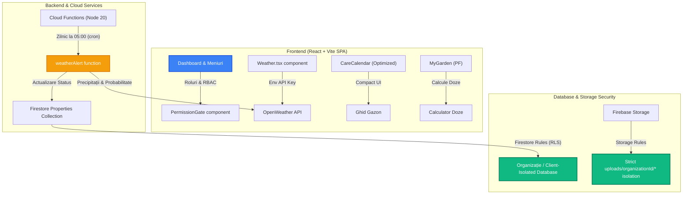

# 📄 LandscapeOS — Manual Tehnic de Predare (Handover Manual)
> **Destinat:** Arhitectului de Sistem / Echipa de Dezvoltare
> **Proiect:** LandscapeOS (Sistem de Gestiune și Optimizare Peisagistică)
> **Data:** 17 Mai 2026
> **Status:** Finalizat în Producție (Hosting: Live, Cloud Functions: Node 20 Active)

---

## 1. Arhitectura de Înalt Nivel (High-Level Architecture)

Aplicația LandscapeOS utilizează o arhitectură serverless securizată bazată pe **Firebase (Firestore, Storage, Functions, Hosting)** și o aplicație SPA modernă construită în **React + TypeScript + Vite**.



---

## 2. Securitatea Datelor & Reguli de Acces (Firestore & Storage Rules)

Am implementat reguli de securitate stricte de tip **Row-Level Security (RLS)** atât pentru documente, cât și pentru imagini/fișiere media.

### A. Firestore Rules (`firestore.rules`)
* **Izolarea Multi-Tenant:** Utilizatorii asociați unei organizații (`organizationId` salvat în profilul utilizatorului `/users/{userId}`) pot citi/scrie date **strict** pentru documentele care aparțin aceleiași organizații.
* **Controlul Rolurilor (RBAC):** Rutele financiare, detaliile clienților B2B și rapoartele sunt protejate complet pe backend. Dacă profilul unui utilizator are tipul de cont `PF` (Homeowner), acesta are acces de citire restricționat strict la proprietățile și jurnalul propriu.

### B. Storage Rules (`storage.rules`)
Regulile de stocare pe cloud asigură că fișierele sunt izolate strict pe bază de `organizationId`:
```javascript
rules_version = '2';
service firebase.storage {
  match /b/{bucket}/o {
    match /uploads/{organizationId}/{allPaths=**} {
      allow read, write: if request.auth != null && 
        firestore.get(/databases/(default)/documents/users/$(request.auth.uid)).data.organizationId == organizationId;
    }
  }
}
```
> [!IMPORTANT]
> Toate imaginile atașate în Jurnalul Grădinii trec printr-un pipeline automat de **compresie locală pe client** înainte de a fi încărcate în folderul izolat din storage, economisind lățime de bandă și stocare pe disc.

---

## 3. Funcționalități Cheie Implementate

### 1. Sistemul Smart Weather & Automatizare Irigații
* **Cloud Function (`weatherAlert`):** Scrisă în **Node 20 (Gen 1)**, rulează zilnic ca o funcție planificată (cronjob) la ora **05:00 Craiova local time**.
* **Logică Inteligentă:** Interoghează OpenWeather API pentru coordonatele localității **Malu Mare, Craiova** (lat: `44.2536`, lon: `23.8642`).
* **Regula de Declanșare:** Dacă prognoza indică o șansă de ploaie **> 50%** și cantitatea depășește **5mm**, funcția:
  1. Trimite o alertă detaliată în sistem.
  2. Modifică dinamic statusul udării în proprietățile asociate în Firestore la `'delayed_by_rain'`.
* **Consola de Control din Frontend:** Oferă butoane interactive pentru utilizator de a suspenda manual udarea pe 24h sau de a forța pornirea manuală (suprascriind starea de ploaie).
* **Integrare PJ (B2B):** Prognoza meteo automată este afișată dinamic pe prima pagină a companiilor PJ pentru **adresa de bază a sediului firmei** (`orgAddress` preluat automat din baza de date), optimizând organizarea echipelor în funcție de precipitațiile locale.

### 2. Ghid Gazon (CareCalendar) — Optimizare Premium a UX-ului
* **Ce am corectat:** Inițial, pagina avea un font masiv de titlu (`text-6xl`), casete goale uriașe pe laptopuri și butoane de luni imense (`w-28 h-40`) care conțineau text redundant (atât abrevierea `IAN`, cât și denumirea completă `IANUARIE`).
* **Designul Compact Actual:**
  * **Titlu Elegant și Fluid:** `text-3xl font-black text-main uppercase tracking-tight` (arătând excelent pe desktop și mobil).
  * **Casete de Informații Tighter:** Secțiunile *„Vegetation Phase”* și *„Personal Tasks”* au fost reduse la micro-panouri ultra-rapide cu margini fine, lăsând spațiul vertical să respire.
  * **Monthly Squares Selector:** Butoanele de navigare pe luni au fost redesenate în **patrate compacte superbe (`w-20 h-20`)**, eliminând denumirile duble de text. Acestea conțin acum doar pictograma sezonului colorată specific și abrevierea din 3 litere a lunii, reducând spațiul vertical irosit cu **peste 50%**!
  * Checklist-ul și sfaturile biologice apar acum imediat pe prima jumătate a ecranului pe laptop, fără a necesita scroll masiv.

### 3. Calculatorul de Doze de Tratamente (MyGarden.tsx)
* Integrat direct în interfața PF, permite calculul ultra-precis al diluției de apă și a necesarului exact de produs, returnând prețul total estimat în lei.
* **Date Produse:**
  * *Champ 77 WG* (Fungicid, 24 lei / 200g)
  * *Kupferol* (Fungicid, 31 lei / 500ml sau 54 lei / 1L)
  * *Alcupral 50 PU* (Fungicid, 69 lei / kg)

---

## 4. Solicitare de Sfaturi & Întrebări pentru Arhitect (Call for Expert Advice)

Stimate Arhitect, pentru a pregăti LandscapeOS pentru următoarea etapă de scalare și extindere la nivel național, aș dori să îți solicit părerea de expert cu privire la următoarele aspecte tehnice:

### ❓ Întrebarea 1: Integrarea Hardware IoT pe Viitor
În prezent, decizia de amânare a irigațiilor (`delayed_by_rain`) se face pe baza prognozei meteorologice prin Cloud Function.
* *Cum ne recomanzi să structurăm colecțiile Firestore pentru a primi telemetrie directă de la controllere fizice (ex: senzori de umiditate a solului ESP32 sau relee inteligente Tuya/RainBird) fără a depăși limitele de scriere gratuite (gratis) din Firebase Spark Plan?*

### ❓ Întrebarea 2: Strategia de Caching a Prognozei Meteo
Momentan, componenta de Weather interoghează OpenWeather API la fiecare încărcare de Dashboard.
* *Pentru a reduce consumul API-ului gratuit și a îmbunătăți timpul de încărcare pe frontend, ar fi mai eficient să salvăm răspunsul OpenWeather într-un document cache din Firestore cu TTL de 3 ore, sau să implementăm un state manager global (ex: React Query/Zustand) cu persistare locală?*

### ❓ Întrebarea 3: Optimizarea Indexilor Firestore Multi-Tenant
Deoarece regulile Firestore folosesc citiri mapate prin `/users/{userId}` pentru validarea `organizationId`-ului:
* *Consideri că ar trebui să adăugăm indexi compuși automați pe toate colecțiile tranzacționale (`visits`, `garden_tasks`, `client_history`) sau structura actuală single-field este suficientă pentru primele 10,000 de proprietăți active?*

---

> [!TIP]
> Toate modificările de cod detaliate în acest manual tehnic au fost **comise, verificate prin teste unitare QA și publicate cu succes pe GitHub** la branch-ul principal `main`. Aplicația este complet pregătită pentru feedback și analiză detaliată!
